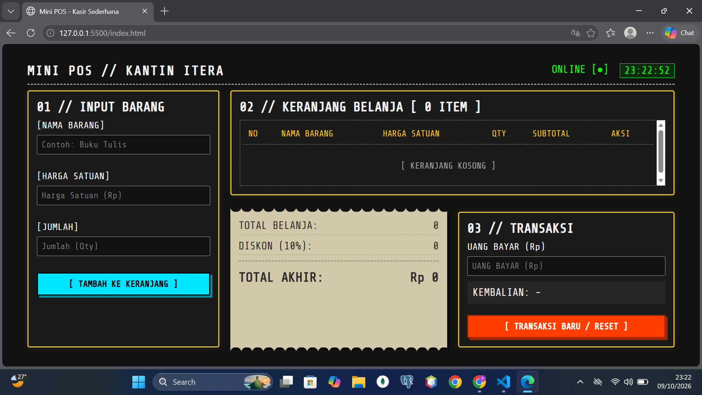
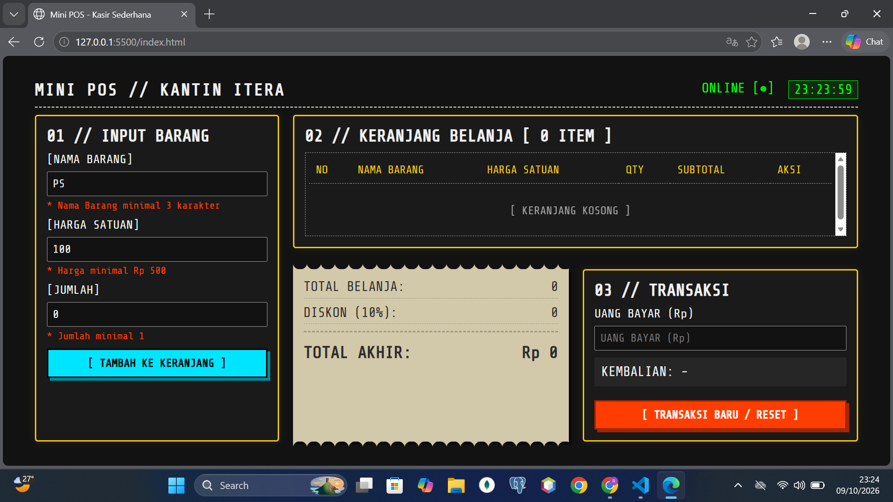
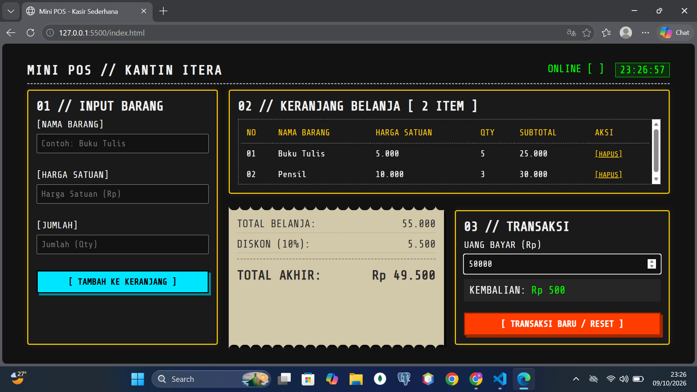

# Tugas Pertemuan 1: Aplikasi Kasir Mini POS

## Identitas
- **Nama:** Roy Kurniawan
- **NIM:** 124140024
- **Kelas Praktikum:** RA

## Deskripsi Aplikasi
Mini POS (Point of Sale) adalah aplikasi kasir berbasis web sederhana yang dibangun menggunakan HTML, CSS, dan murni Vanilla JavaScript. Aplikasi ini bertujuan untuk mensimulasikan sistem kasir di kantin ITERA dengan fungsi validasi data masukan, perhitungan matematis untuk total belanja dan diskon, serta implementasi penyimpanan persisten agar daftar belanja tidak hilang ketika halaman di refresh.

## Panduan Menjalankan
1. Pastikan Anda memiliki *code editor* (misalnya Visual Studio Code).
2. Buka folder proyek `roykurniawan_124140024_pertemuan1` di VS Code.
3. Instal ekstensi **Live Server**.
4. Klik kanan pada file `index.html` dan pilih **"Open with Live Server"**.
5. Halaman akan otomatis terbuka di browser lokal Anda.

## Daftar Fitur
- [x] Validasi input form (Nama minimal 3 karakter, Harga min Rp 500, Qty min 1).
- [x] Pencegahan form tersubmit jika terdapat nilai input *error* dengan notifikasi teks merah.
- [x] Kalkulasi subtotal barang dan total keseluruhan belanja secara otomatis.
- [x] Kalkulator diskon sederhana otomatis (Potongan 10% jika total >= Rp 50.000).
- [x] Fitur menghapus barang dari keranjang belanja secara spesifik per baris.
- [x] Kalkulasi otomatis kembalian pembayaran secara *real-time*.
- [x] Interaksi dan sinkronisasi data tabel belanja dengan API `localStorage`.
- [x] Tombol reset transaksi baru.

## Tangkapan Layar (Screenshot)
1. **Tampilan Form Input Utama:** 
2. **Tampilan Validasi Error:** 
3. **Tampilan Hasil Perhitungan & Tabel:** 

## Penjelasan Teknis Singkat
Logika JavaScript utama dibangun menggunakan penanganan *Event Listener* pada objek formulir dan *input tag*. Validasi diatur dengan *conditional statement* (`if-else`), yang mengeksekusi peringatan jika data berada di luar batasan persyaratan. Algoritma keuangan dieksekusi dengan fungsi array `forEach()` untuk mendapatkan subtotal iteratif dan mengurangi diskon. Fitur serialisasi menggunakan instruksi `JSON.stringify()` untuk mengubah format _array of objects_ milik daftar barang menjadi string JSON sebelum diinjeksikan ke memori _browser_ via `localStorage.setItem`, dan `JSON.parse()` saat menarik kembali _state_ awal memori aplikasi.
